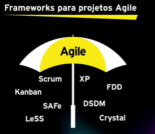

# O que é ágil?
Entregando o valor sempre de forma organizada (2-4 semanas e vai melhorando aquilo). "Pensando em valores --> Valor de forma ordena", coisas que já funcionam e se constroem nesse meio tempo.

Destaques:
* Entregas constantes e incrementais;
* Cooperação do time com o cliente;
* Alta qualidade e foco no valor;
* Adaptabilidade às mudanças
* Valor de acordo com as necessidades do cliente.

Visão geral:
Não é uma metodologia nem framework, é um **mindset** (forma de pensar, setado na cabeça), composto por **4 valores** e **12 princípios**. 

**Manifesto ágil**, criado em 2001, quando 17 profissionais resolveram se juntar com suas abordagens.  

Valores:
1. Indivíduos e interações acima de processos e ferramentas;
2. Software funcionando é melhor que documentação abrangente;
3. Colaboração com o cliente acima de negociação e contratos;
4. Responder a mudanças ao invés de seguir um plano. 

Princípios: 
“Nossa maior prioridade é satisfazer o cliente através da entrega contínua e adiantada de software com valor agregado”

“Mudanças nos requisitos são bem-vindas, mesmo tardiamente no desenvolvimento. Processos ágeis tiram vantagem das mudanças visando vantagem competitiva para o cliente”

“Entregar frequentemente software funcionando, de poucas semanas a poucos meses, com preferência à menor escala de tempo”

“Pessoas de negócio e desenvolvedores devem trabalhar em conjunto diariamente por todo o projeto”

“Construa projetos em torno de indivíduos motivados. Dê a eles o ambiente e o suporte necessário e confie neles para fazer o trabalho”

“O método mais eficiente e eficaz de transmitir informações para e entre uma equipe de desenvolvimento é por meio de conversa face a face”

“Software funcionando é a medida primária de progresso”

“Os processos ágeis promovem desenvolvimento sustentável. Os patrocinadores, desenvolvedores e usuários devem ser capazes de manter um ritmo constante indefinidamente”

“Contínua atenção à excelência técnica e bom design aumenta a agilidade”

“Simplicidade – a arte de maximizar a quantidade de trabalho não realizado – é essencial”

“As melhores arquiteturas, requisitos e designs emergem de equipes auto-organizáveis”

“Em intervalos regulares, a equipe reflete sobre como se tornar mais eficaz e então refina e ajusta seu comportamento de acordo.”

---

**Antes do Ágil...**
Antes a metodologia tradicional seguia o "waterfall" ou "cascata", onde era pouco flexível, baixa mudanças (changes requests) e a documentação era feita de forma documentado e amarrado. Isso é ruim, porque tudo muda muito rápido.

**Quando não usar o Ágil**
Entrega mais rápido, relação com clientes, gerenciamento de riscos, produtos com maior qualidade e planejamento incremental.

**Quando não usar o Ágil**
* Projetos regulatórios, sistemas críticos ou de segurança;
* Estrutura organizacional;
* Falta de experiência e habilidade no tema;
* Fatores extermos.

## Metodologias

### Scrum
Criado em 1993, por Jeff Sutherland. Framework baseado no mindset ágil.

**Papéis:** Product Owner, Scrum Master e time.
**Artefatos:** Backlog do produto, Backlog da Sprint, Reportes e métricas e produto.
**Cerimônias:** Refinamento do backlog, Planejamento da Sprint, Reuniões Diárias (daily), Review da Sprint e Retrospectiva da Sprint.

