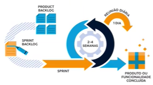

# SCRUM

## Product Owner (dono do produto)
- Entrega valor ao negócio;
- Tomador de decisões;
- Único responsável pelo gerenciamento do backlog;
- Garante o envolvimento das demais stakeholders (pessoas de interesse, como patrocionadores);
- Prioriza entregas e releases (coloquei em produção).

## Scrum Master (é um líder servo)
- Garante velocidade e fluxo de trabalho do time;
- Responsável pela execução das cerimônias do SCRUM

## Time
- Não possui papéis predeterminados, mesmo título;
- Todos são responsáveis pelo trabalho;
- Cross-Functional e multidisciplinary;
- Autor-organização/gestão de tarefas.

Fluxo na prática

## Scrim Guide
O **Scrum Guide** é um guia de consulta para profissionais que querem trabalhar com a metodologia ágil Scrum.

[Guia do Scrum](scrum.org)