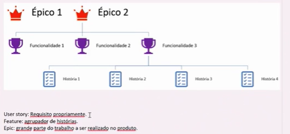

# Azure DevOps
Create a new project, with this step-by-step:

Project name 
Description
Public or Private
Select --> Scrum

- Boards: controle e fluxo de trabalho
- Repos: controle de código
- Pipelines: pegar e mandar para o produtivo
- Test Plans: testes
Artifacts: artefatos de build

Tem como colocar como default ou não...

## O que fica nos Backlogs

Itens são do tipo:
- Epic (ação, app)
- Feature (uma linha de trabalho, funcionalidade)
- UserStory (igual descrição, que podem ter testes)

Podemos criar *Tasks* (tarefas) ou *relacionamentos* entre eles.

