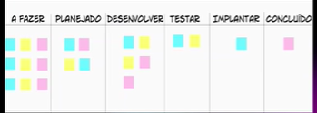

# XP e Kanban

## XP - Extreme Programming 
Aliada ao Scrum, possui valores como comunicação, simplicidade, feedback rápido, trabalho de alta qualidade, melhoria diversidade... 

1. UserStories: Eu como [usuário] quero [requisito]

São especificações, quero isso, dessa forma, para isso...

2. Depois eu passo para uma fase de coding (código)

3. Depois eu entro para a fase de testing (QA - equipe de qualidade)

## Kanban
Modelo orgaziional de gestão visual, para melhor visualização e controle de tarefas e como o projeto está evoluindo. Ele gerencia o fluxo e o tempo de trabalho de cada tarefa. 

Algo muito visual (post-it), por quadrantes.

## Ágil
Mentalidade, é uma forma de pensar. 
Já seus frameworks tem o Scrum (sprints que entregam de 2-4 semanas), o XP (relacionada a software e sistemas), o Kanban (To-do).